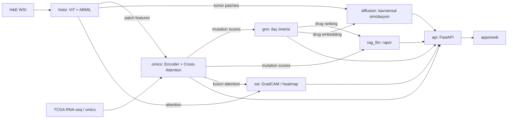
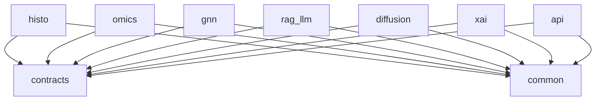

# ONKOS Mimarisi

5 katmanlı yığın: Frontend (React/Next.js) → API (FastAPI) → AI model katmanı (PyTorch, MONAI,
HuggingFace) → Veri (PostgreSQL, MongoDB, DVC) → Altyapı (bulut GPU, Docker).

## Veri akışı

## Modül bağımlılık grafiği

Modüller birbirini import etmez; yalnızca ortak paketlere bağlanır (ADR-0001).

Çalışma zamanında modüller `contracts` içindeki şemalarla (HDF5 özellik dosyaları, JSON/Pydantic
nesneleri) konuşur; `api` bunları HTTP'ye çevirir. Sözleşme ayrıntıları mini sprint 1.7'de.
